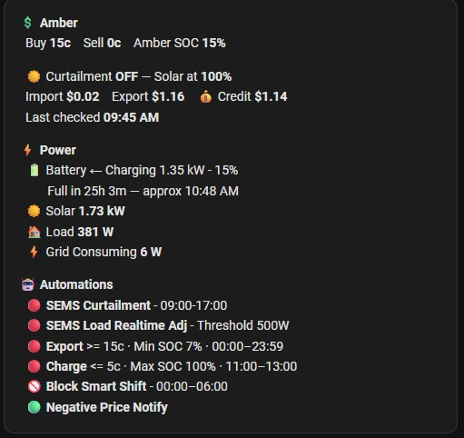

<table><tr><td></td><td><h1>Home Assistant GoodWe SEMS Curtailment</h1></td></tr></table>

[](https://www.buymeacoffee.com/kane81)


[](https://github.com/hacs/integration)
[](https://github.com/kane81/hacs-goodwe-sems-curtailment/releases)
[](https://opensource.org/licenses/MIT)
[](https://analytics.home-assistant.io)

> A Home Assistant custom integration for **[GoodWe](https://www.goodwe.com/)** solar inverters that controls inverter output via the **[SEMS Portal](https://www.semsportal.com/)** API based on **[Amber Electric](https://www.amber.com.au/)** real-time pricing — automatically curtailing solar export when prices are negative and optimising self-consumption.

---

## ⚠️ Requires hacs-custom-amber-integration

**This integration depends on [hacs-custom-amber-integration](https://github.com/kane81/hacs-custom-amber-integration).** It reads the Amber Electric price helpers populated by that project. Install and configure that project first before proceeding.

> **⚠️ IMPORTANT:** After installing via HACS, open **Advanced SSH & Web Terminal** and run:
> ```bash
> bash /config/custom_components/sems_curtailment/install.sh
> ```
> This is required to complete setup. Refer to the README installation steps below.

---

## Features

| Feature | Description |
|---|---|
| **Negative buy price curtailment** | Sets inverter to 0% when Amber buy price goes negative — stops solar export to avoid paying to export |
| **Negative sell price curtailment** | Curtails inverter to match house load + battery charge rate when sell price goes negative |
| **Real-time load tracking** | Adjusts inverter limit in real-time as house load changes during curtailment |
| **Window management** | Resets inverter to 100% at window start and end — clean slate every day |
| **Amber dependency check** | Notifies on startup if hacs-custom-amber-integration is not providing price data |

---

## ⚠️ Disclaimer

This project uses the SEMS Portal API which is not publicly documented or officially supported. GoodWe may change or remove it at any time without notice. This project has no affiliation with GoodWe or SEMS. Use at your own risk — changing inverter output limits directly affects your solar system. The author accepts no responsibility for energy costs, equipment damage or system issues.

---

## ⚠️ Prerequisites

- **[hacs-custom-amber-integration](https://github.com/kane81/hacs-custom-amber-integration) installed and working** — prices must be updating before you install this
- **GoodWe inverter** connected to the SEMS Portal
- **Home Assistant OS or Supervised** with HACS installed

### Have on hand before starting

**SEMS Account**

| What | Notes |
|---|---|
| **SEMS Portal login email** | Your GoodWe SEMS Portal account email |
| **SEMS Portal password** | Your GoodWe SEMS Portal account password |
| **Inverter serial number** | Printed on the label on your inverter |

**Battery & Inverter Details**

| What | Notes |
|---|---|
| **Solar inverter capacity** | Rated output in watts — e.g. GW10K-MS = **10000W** |
| **Battery max charge rate** | Maximum charge rate in watts — e.g. AlphaESS Smile5 = **4640W** |
| **Battery Capacity** | Usable storage in kWh — e.g. AlphaESS Smile5 = **9.6 kWh**. This is used to calculate time-to-full on the dashboard card. |

**Sensor Entity IDs**

These tell the integration which sensors to read from your battery. The integration can function without them but curtailment calculations will be less accurate.

**How to find your sensor Entity IDs:**
1. Go to **Settings → Devices & Services** → find your battery integration
2. Click on the entity you want (e.g. Battery SOC)
3. Click the **⚙️ cog** icon → copy the **Entity ID**
4. The Entity ID must be the full ID including the domain — e.g. `sensor.al7011025073833_instantaneous_battery_soc`

Alternatively go to **Developer Tools → States** and search for your battery name.

| What | Notes |
|---|---|
| **Battery SOC sensor** | State of charge 0–100%. Example: `sensor.al7011025073833_instantaneous_battery_soc` |
| **Battery I/O Power sensor** | Negative = charging, positive = discharging. Example: `sensor.al7011025073833_instantaneous_battery_i_o` |
| **House Load sensor** | Current house consumption in watts. Example: `sensor.al7011025073833_instantaneous_load` |
| **Solar Production sensor** | Current solar generation in watts. Example: `sensor.al7011025073833_instantaneous_generation` |
| **Grid Power sensor** | Positive = importing, negative = exporting. Example: `sensor.al7011025073833_instantaneous_grid_i_o_total` |

> The example sensor IDs above are from the **[homeassistant-alphaESS](https://github.com/CharlesGillanders/homeassistant-alphaESS)** integration by Charles Gillanders — a great community integration for AlphaESS batteries. Any battery integration that exposes these values as HA sensors will work.

> **No battery sensors installed?** The integration will still work but:
> - **SEMS Load Tracking Adjustments** will not function (requires a load sensor)
> - **Curtailment** will read load as 0W, so when curtailment activates it will set the inverter output to near-zero — effectively preventing all export
> - Setting output to 0% does **not** turn the inverter off — a small amount of power will still leak through. This is intentional, as a fully powered-off inverter takes several minutes to restart and reconnect

The install script will prompt you to enter all of these — just copy and paste.

---

## Installation

### Step 1 — Install Prerequisites

Install **HACS** and **Advanced SSH & Web Terminal** if not already done — see the [hacs-custom-amber-integration README](https://github.com/kane81/hacs-custom-amber-integration#installation) for step-by-step instructions.

---

### Step 2 — Install hacs-custom-amber-integration First

This integration requires Amber Electric prices to be available in HA. If you haven't already, install and configure [hacs-custom-amber-integration](https://github.com/kane81/hacs-custom-amber-integration) first and verify prices are updating before continuing.

---

### Step 3 — Install via HACS

1. Open **HACS** in your HA sidebar
2. Click **⋮** (top right) → **Custom repositories**
3. Paste: `https://github.com/kane81/hacs-goodwe-sems-curtailment`
4. Category: **Integration** → **Add**
5. Search for **hacs-goodwe-sems-curtailment** → **Download**

HACS downloads the integration into `/config/custom_components/sems_curtailment/`.

---

### Step 4 — Run the Install Script

Open **Advanced SSH & Web Terminal** and run:

```bash
bash /config/custom_components/sems_curtailment/install.sh
```
> 💡 **Terminal tip:** To paste into the terminal use **Right Click → Paste**. Do not use Ctrl+V — it will not work in the HA terminal.


The script walks you through the following steps:

**Step 4a — SEMS Credentials**

```
🔑 Checking SEMS credentials in secrets.yaml...

   Enter SEMS Portal login email: you@example.com
   ✅ sems_email saved

   Enter SEMS Portal password: ••••••••
   ✅ sems_password saved

   Enter Inverter serial number (on inverter label): ESXXXXXXXX
   ✅ sems_inverter_sn saved
```

**Step 4b — HA Token** *(only if not already set by the Amber integration)*

```
🔑 HA Long-Lived Access Token not found in secrets.yaml
   To get a token: Profile avatar (bottom left) → Long-Lived Access Tokens → Create Token

   Enter your HA Long-Lived Access Token: eyJ...
   ✅ Token saved to secrets.yaml
```

**Step 4c — Dashboard**

```
📊 Dashboard
   Create SEMS dashboard in sidebar? (Y/n): Y
   ✅ Dashboard created: /config/lovelace/sems.yaml
```

Answer **Y** to create the **SEMS** dashboard in your sidebar, or **n** to skip and add manually later.

**Step 4d — Battery & Inverter Details**

```
⚙️  Battery & Inverter Details
   Press Enter to accept the default value shown in brackets.

   Solar inverter capacity (e.g. GW10K-MS = 10000) [10000 W]: 10000
   ✅ Solar inverter capacity set to 10000 W

   Battery max charge rate (AlphaESS Smile5 = 4640) [3000 W]: 4640
   ✅ Battery max charge rate set to 4640 W

   Battery Capacity [10 kWh]: 9.6
   ✅ Battery Capacity set to 9.6 kWh

   Load change threshold (min watts before API call) [500 W]:
   ✅ Load change threshold set to 500 W
```

**Step 4e — Battery Sensor Entity IDs**

> 💡 **Finding your Entity IDs:** Go to the entity → click the **⚙️ cog** → copy the **Entity ID**. It must be the full ID including the domain e.g. `sensor.your_entity_name`. You can also find them in **Developer Tools → States**.

```
🔌 Battery Sensor Entity IDs
   Find your sensor IDs in Developer Tools → States.
   Press Enter to skip any and configure later in Overview → Devices → Helpers.

   Battery SOC sensor (0-100%)
   Example: sensor.al7011025073833_instantaneous_battery_soc
   Enter entity ID (or press Enter to skip): sensor.al7011025073833_instantaneous_battery_soc
   ✅ Battery SOC sensor set to sensor.al7011025073833_instantaneous_battery_soc (current value: 68.0)
```

Repeat for each sensor. After all sensors are entered the script will confirm how many were configured and warn if any are missing.

**Step 4f — Automatic configuration**

The script automatically updates `configuration.yaml`, reloads HA YAML and sets default helper values. No action required — just wait for it to complete.

The output should end with:
```
✅ Install complete!
```

> **After this first run** the `sems_hacs_auto_install` automation handles all future HACS updates automatically.

> **To re-run the full installer** at any time (e.g. to reconfigure sensors or re-add the dashboard):
> ```bash
> bash /config/custom_components/sems_curtailment/install.sh
> ```

---

### Step 5 — Dashboard Card



If you opted to install the dashboard during setup, there will be a **SEMS** dashboard in your sidebar. Click on it to see your controls. Click **Poll Amber Prices Now** to load current pricing — data will be at default settings until the first poll runs.

If you did not opt to auto install, see below for manual instructions.

---

### Using the Dashboard Card

The SEMS dashboard shows real-time solar, battery, load and grid power alongside Amber pricing, automation status and all configurable controls in one place.

**Icon legend:** 🟢 enabled & active · 🔴 enabled, waiting for conditions · 🚫 disabled

#### Manually Adding the Card

1. Go to **Settings → Dashboards → Add Dashboard** → **New dashboard from scratch** → give it a name
2. Open it from the sidebar → click **Edit**
3. Click **+ Add Card** → search for **Markdown**
4. Copy the card template from [`custom_components/sems_curtailment/dashboard_card.txt`](custom_components/sems_curtailment/dashboard_card.txt) and paste into the Content field
5. Click **Save**

---

### Step 6 — Restart HA

Go to **Settings → System → Restart** to apply all changes. After restart:
- The **SEMS** dashboard will appear in your sidebar
- The SEMS automations will load and begin monitoring prices


## Manual Commands

```bash
python3 /config/scripts/sems_power.py 100   # Reset inverter to full output
python3 /config/scripts/sems_power.py 50    # Set to 50%
python3 /config/scripts/sems_power.py 0     # Set to 0% (effectively off)
```

---

## Architecture

📐 [Click here to view the Architecture Diagram](images/architecture.png)

---

## Uninstalling

Removing this integration via HACS only deletes the `custom_components` folder — automation files, packages, scripts and helpers are left behind. To fully remove everything run the uninstall script first:

```bash
bash /config/custom_components/sems_curtailment/uninstall.sh
```

Then remove from HACS and restart HA.

## Troubleshooting

**Dependency warning on startup** — install [hacs-custom-amber-integration](https://github.com/kane81/hacs-custom-amber-integration) and ensure it is polling prices. Check `amber_general_price_actual` in Developer Tools → States.

**Login failed** — check `sems_email` and `sems_password` in `secrets.yaml`. Verify you can log into [au.semsportal.com](https://au.semsportal.com).

**Inverter not responding** — check `sems_inverter_sn` matches the serial number on your inverter label exactly. Verify inverter is online in the SEMS+ app.

**Curtailment not firing** — confirm **Enable Automation: SEMS Solar Curtailment** is ON in Overview → Devices → Helpers. Check the automation trace — the condition block shows exactly why it exited early.

**Load tracking not adjusting** — confirm **Enable Automation: SEMS Load Tracking Adjustments** is ON. Check sensor helper entity IDs are set correctly in Overview → Devices → Helpers.

**After any config change** — Developer Tools → YAML → Reload All (or restart HA).

---

## Related Projects

- [hacs-custom-amber-integration](https://github.com/kane81/hacs-custom-amber-integration) — **required** — provides Amber Electric price helpers

---

## License

MIT — see [LICENSE](LICENSE) file. See disclaimer above regarding the undocumented SEMS Portal API.

## Contributing

Issues and PRs welcome. Contributions should include testing against the current SEMS+ app to verify API compatibility.

---

## Credits

- **[hacs-custom-amber-integration](https://github.com/kane81/hacs-custom-amber-integration)** — the companion Amber Electric integration this project depends on
- **[Official Amber Electric Integration](https://www.home-assistant.io/integrations/amberelectric/)**
- **[homeassistant-alphaESS](https://github.com/CharlesGillanders/homeassistant-alphaESS)** by Charles Gillanders — AlphaESS battery integration used as sensor reference
- Thanks to **hudakh**, **chrismalec87**, 6minchinbury, **Jacob Kairl** and the rest of the beta testers.
