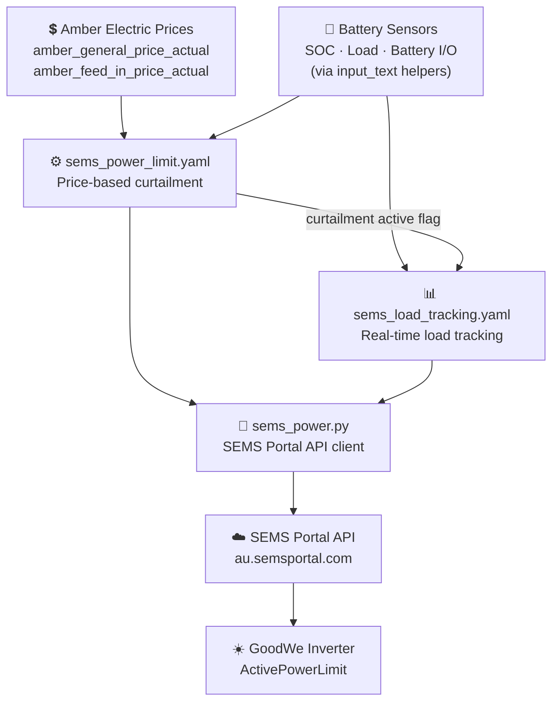

# hacs-goodwe-sems-curtailment

[](https://github.com/hacs/integration)
[](https://github.com/kane81/hacs-goodwe-sems-curtailment/releases)
[](https://opensource.org/licenses/MIT)
[](https://analytics.home-assistant.io)

> **Controls GoodWe solar inverter output via the SEMS Portal API based on Amber Electric pricing, preventing unwanted solar export when prices are negative.**

---

## ⚠️ Requires hacs-custom-amber-integration

**This integration depends on [hacs-custom-amber-integration](https://github.com/kane81/hacs-custom-amber-integration).** It reads the Amber Electric price helpers populated by that project. Install and configure that project first before proceeding.

---

## 🚧 Early Beta — In Development

- Automations may behave unexpectedly in edge cases
- Breaking changes may occur between versions
- Monitor your system closely after installation
- Feedback welcome via [GitHub Issues](https://github.com/kane81/hacs-goodwe-sems-curtailment/issues)

---

## ⚠️ Disclaimer

This project uses the SEMS Portal API which is not publicly documented or officially supported. GoodWe may change or remove it at any time without notice. This project has no affiliation with GoodWe or SEMS. Use at your own risk — changing inverter output limits directly affects your solar system. The author accepts no responsibility for energy costs, equipment damage or system issues.

---

## What It Does

| Feature | Description |
|---|---|
| **Negative buy price curtailment** | Sets inverter to 0% when Amber buy price goes negative — stops solar export to avoid paying to export |
| **Negative sell price curtailment** | Curtails inverter to match house load + battery charge rate when sell price goes negative |
| **Real-time load tracking** | Adjusts inverter limit in real-time as house load changes during curtailment |
| **Window management** | Resets inverter to 100% at window start and end — clean slate every day |
| **Amber dependency check** | Notifies on startup if hacs-custom-amber-integration is not providing price data |

Both automations are **off by default** — enable them individually from Settings → Helpers once you have verified the integration is working.

---

## Architecture



---

## Installation

### Step 0 — Install hacs-custom-amber-integration First

This integration will not function without Amber Electric prices being available in HA. If you haven't already, install and configure [hacs-custom-amber-integration](https://github.com/kane81/hacs-custom-amber-integration) first and verify prices are updating before continuing.

---

### Step 1 — Add via HACS

1. Open **HACS** in your HA sidebar
2. Click **⋮** (top right) → **Custom repositories**
3. Paste: `https://github.com/kane81/hacs-goodwe-sems-curtailment`
4. Category: **Integration** → **Add**
5. Search for **hacs-goodwe-sems-curtailment** → **Download**

HACS downloads the integration into `/config/custom_components/sems_curtailment/`.

**This is a one-time step.** Open **Terminal & SSH** and run the install script:

```bash
bash /config/custom_components/sems_curtailment/install.sh
```

The script will:
- Copy all automations, scripts, packages and templates to `/config/`
- Check your `configuration.yaml` for any missing lines
- Check that hacs-custom-amber-integration is installed
- Tell you exactly what to fix if anything is missing

**Verify it completed successfully** — the output should end with:
```
✅ Install complete!
```

If you see any ⚠️ warnings, follow the instructions printed by the script before continuing.

> **After this first run** the `sems_hacs_auto_install` automation is active. All future HACS updates will run the install script automatically.

---

### Step 2 — Add SEMS Credentials

Open **Studio Code Server** from the sidebar and open `/config/secrets.yaml`.

Add the following:

```yaml
sems_email: "your@email.com"
sems_password: "your-sems-password"
sems_inverter_sn: "YOUR_INVERTER_SERIAL"
```

Save with **Ctrl+S**.

**Finding your inverter serial number:**
- Printed on the label on your physical inverter
- Also visible in **SEMS+ app → Device → Device Info**

---

### Step 3 — Restart HA

**Settings → System → Restart**

> ⚠️ **Every HA restart resets helpers to their initial values.** All automation enable toggles will reset to OFF and sensor configurations will reset to placeholders. After each restart you will need to re-enable automations and re-set sensor entity IDs via Settings → Helpers.

---

### Step 4 — Configure Battery Sensors

Go to **Settings → Helpers** and set the five `Sensor -` helpers to point to your battery integration's entity IDs:

| Helper | Set to |
|---|---|
| **Sensor - Battery SOC** | Your battery SOC sensor entity ID |
| **Sensor - Battery I/O Power** | Your battery power sensor (negative=charging) |
| **Sensor - House Load** | Your house load sensor in watts |
| **Sensor - Solar Power** | Your solar production sensor in watts |
| **Sensor - Grid Power** | Your grid power sensor (see note below) |

> **AlphaESS grid sensor note:** Use `sensor.al7011025073833_instantaneous_grid_i_o_total`. AlphaESS reports negative=export — the dashboard card negates this automatically.

Also set:
- **Battery Max Charge Rate** → your battery's max charge rate in watts (AlphaESS Smile5: 4640W)
- **Battery Capacity** → your battery's usable capacity in kWh
- **SEMS Inverter Capacity** → your inverter's rated capacity in watts

---

### Step 5 — Test the Script

Open **Terminal & SSH** and run:

```bash
python3 /config/scripts/sems_power.py 100
```

Expected output:
```
Loading credentials from /config/secrets.yaml...
Credentials loaded. Inverter SN: YOUR_SN
Result: {"code": 0, "msg": "Success", ...}
```

Test curtailment:
```bash
python3 /config/scripts/sems_power.py 50
```

Verify in the **SEMS+ app**: tap your inverter → **Configure** → **Active Power (%)** should show 50.

Restore to full output:
```bash
python3 /config/scripts/sems_power.py 100
```

---

### Step 6 — Enable Automations

Both automations are **off by default**. Enable via **Settings → Helpers**:

| Helper | Enables | Default |
|---|---|---|
| `sems_enable_power_limit` | Price-based curtailment | OFF |
| `sems_enable_load_tracking` | Real-time load adjustment | OFF |

Enable `sems_enable_power_limit` first. Only enable `sems_enable_load_tracking` once power limit is working correctly — load tracking fine-tunes limits that power limit sets.

> ⚠️ Automation toggles reset to OFF on every HA restart. Re-enable after each restart.

---

## Configuration

All settings adjustable without editing YAML.

### Option A — Overview → Devices & Services (recommended)

1. Go to your **Overview** dashboard
2. Click **Devices & Services** (top right)
3. Select the **Helpers** tab
4. Find and update the helper — changes take effect immediately

### Option B — Settings → Helpers

Go to **Settings → Helpers**, find the helper by name and click to edit.

### Settings

| Helper | Default | Purpose |
|---|---|---|
| `sems_inverter_capacity_w` | 10000W | Inverter rated output in watts |
| `sems_load_threshold_watts` | 500W | Min change in watts before API call (lower = more responsive) |
| `battery_max_charge_rate_w` | 3000W | Battery max charge rate — sets curtailment floor |
| `battery_capacity_kwh` | 10 kWh | Battery capacity for time-to-full estimate |
| `sems_curtailment_start` | 10:00 | Start of curtailment monitoring window |
| `sems_curtailment_end` | 17:00 | End of curtailment monitoring window |

---

## Manual Commands

```bash
python3 /config/scripts/sems_power.py 100   # Reset inverter to full output
python3 /config/scripts/sems_power.py 50    # Set to 50%
python3 /config/scripts/sems_power.py 0     # Set to 0% (effectively off)
```

---

## Troubleshooting

**Dependency warning on startup** — install [hacs-custom-amber-integration](https://github.com/kane81/hacs-custom-amber-integration) and ensure it is polling prices. Check `amber_general_price_actual` in Developer Tools → States.

**Login failed** — check `sems_email` and `sems_password` in `secrets.yaml`. Verify you can log into [au.semsportal.com](https://au.semsportal.com).

**Inverter not responding** — check `sems_inverter_sn` matches the serial number on your inverter label exactly. Verify inverter is online in the SEMS+ app.

**Curtailment not firing** — confirm `sems_enable_power_limit` is ON in Settings → Helpers. Check the automation trace — the condition block shows exactly why it exited early.

**Load tracking not adjusting** — confirm `sems_enable_load_tracking` is ON. Check sensor helper entity IDs are set correctly in Settings → Helpers.

**After any config change** — Developer Tools → YAML → Reload All (or restart HA).

---

## Related Projects

- [hacs-custom-amber-integration](https://github.com/kane81/hacs-custom-amber-integration) — **required** — provides Amber Electric price helpers

---

## License

MIT — see [LICENSE](LICENSE) file. See disclaimer above regarding the undocumented SEMS Portal API.

## Contributing

Issues and PRs welcome. Contributions should include testing against the current SEMS+ app to verify API compatibility.
