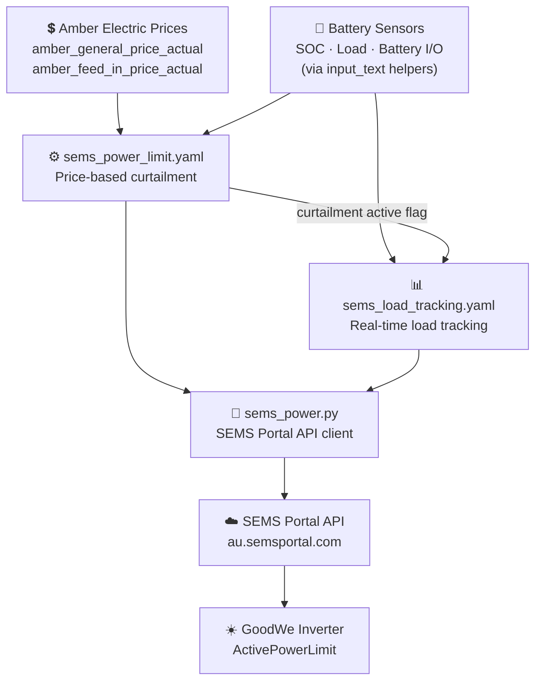

<p align="center"></p>

# Home Assistant GoodWe SEMS Curtailment

[](https://github.com/hacs/integration)
[](https://github.com/kane81/hacs-goodwe-sems-curtailment/releases)
[](https://opensource.org/licenses/MIT)
[](https://analytics.home-assistant.io)

> **Controls GoodWe solar inverter output via the SEMS Portal API based on Amber Electric pricing, preventing unwanted solar export when prices are negative.**

---

## ⚠️ Requires hacs-custom-amber-integration

**This integration depends on [hacs-custom-amber-integration](https://github.com/kane81/hacs-custom-amber-integration).** It reads the Amber Electric price helpers populated by that project. Install and configure that project first before proceeding.

---

## 🚧 Early Beta — In Development

- Automations may behave unexpectedly in edge cases
- Breaking changes may occur between versions
- Monitor your system closely after installation
- Feedback welcome via [GitHub Issues](https://github.com/kane81/hacs-goodwe-sems-curtailment/issues)

---

## ⚠️ Disclaimer

This project uses the SEMS Portal API which is not publicly documented or officially supported. GoodWe may change or remove it at any time without notice. This project has no affiliation with GoodWe or SEMS. Use at your own risk — changing inverter output limits directly affects your solar system. The author accepts no responsibility for energy costs, equipment damage or system issues.

---

## What It Does

| Feature | Description |
|---|---|
| **Negative buy price curtailment** | Sets inverter to 0% when Amber buy price goes negative — stops solar export to avoid paying to export |
| **Negative sell price curtailment** | Curtails inverter to match house load + battery charge rate when sell price goes negative |
| **Real-time load tracking** | Adjusts inverter limit in real-time as house load changes during curtailment |
| **Window management** | Resets inverter to 100% at window start and end — clean slate every day |
| **Amber dependency check** | Notifies on startup if hacs-custom-amber-integration is not providing price data |

Both automations are **off by default** — enable them individually from Settings → Devices & Services → Helpers tab once you have verified the integration is working.

---

## Architecture



---

## Installation

### Step 0 — Install hacs-custom-amber-integration First

This integration will not function without Amber Electric prices being available in HA. If you haven't already, install and configure [hacs-custom-amber-integration](https://github.com/kane81/hacs-custom-amber-integration) first and verify prices are updating before continuing.

---

### Step 1 — Add via HACS

1. Open **HACS** in your HA sidebar
2. Click **⋮** (top right) → **Custom repositories**
3. Paste: `https://github.com/kane81/hacs-goodwe-sems-curtailment`
4. Category: **Integration** → **Add**
5. Search for **hacs-goodwe-sems-curtailment** → **Download**

HACS downloads the integration into `/config/custom_components/sems_curtailment/`.

**This is a one-time step.** Open **Terminal & SSH** and run the install script:

```bash
bash /config/custom_components/sems_curtailment/install.sh
```

The script will:
- Copy all automations, scripts, packages and templates to `/config/`
- Check your `configuration.yaml` for any missing lines
- Check that hacs-custom-amber-integration is installed
- Tell you exactly what to fix if anything is missing

**Verify it completed successfully** — the output should end with:
```
✅ Install complete!
```

If you see any ⚠️ warnings, follow the instructions printed by the script before continuing.

> **After this first run** the `sems_hacs_auto_install` automation is active. All future HACS updates will run the install script automatically.

---

### Step 2 — Add SEMS Credentials

Open **Studio Code Server** from the sidebar and open `/config/secrets.yaml`.

Add the following:

```yaml
sems_email: "your@email.com"
sems_password: "your-sems-password"
sems_inverter_sn: "YOUR_INVERTER_SERIAL"
```

Save with **Ctrl+S**.

**Finding your inverter serial number:**
- Printed on the label on your physical inverter
- Also visible in **SEMS+ app → Device → Device Info**

---

### Step 3 — Restart HA

**Settings → System → Restart**

> ⚠️ **Every HA restart resets helpers to their initial values.** All automation enable toggles will reset to OFF and sensor configurations will reset to placeholders. After each restart you will need to re-enable automations and re-set sensor entity IDs via Settings → Devices & Services → Helpers tab.

---

### Step 4 — Configure Battery Sensors

Go to **Overview → Devices → Helpers tab** and configure the following helpers. All values persist across restarts — you only need to set these once.

#### Sensor Entity IDs

Set each `Sensor -` helper to the entity ID from your battery integration:

| Helper | What to set it to | AlphaESS example |
|---|---|---|
| **Sensor - Battery SOC** | Battery state of charge (0–100%) | `sensor.al7011025073833_instantaneous_battery_soc` |
| **Sensor - Battery I/O Power** | Battery power — negative=charging, positive=discharging | `sensor.al7011025073833_instantaneous_battery_i_o` |
| **Sensor - House Load** | House load in watts | `sensor.al7011025073833_instantaneous_load` |
| **Sensor - Solar Power** | Solar production in watts | `sensor.al7011025073833_instantaneous_generation` |
| **Sensor - Grid Power** | Grid power — see note below | `sensor.al7011025073833_instantaneous_grid_i_o_total` |

> **AlphaESS grid sensor note:** AlphaESS reports negative=export. The dashboard card handles the sign convention automatically.

#### System Settings

| Helper | Default | Set to |
|---|---|---|
| **Battery Max Charge Rate** | 3000W | Your battery's maximum charge rate in watts. AlphaESS Smile5: **4640W**. Check your battery spec sheet. |
| **Battery Capacity** | 10 kWh | Your battery's usable capacity in kWh. Used for time-to-full estimate only. |
| **SEMS Inverter Capacity** | 10000W | Your GoodWe inverter's rated output in watts. e.g. GW10K-MS = **10000W**. |
| **SEMS Curtailment Start** | 10:00 | Start of curtailment monitoring window |
| **SEMS Curtailment End** | 17:00 | End of curtailment monitoring window |
| **SEMS Load Change Threshold** | 500W | Min watts change before updating inverter via API. Lower = more responsive. |

---

### Step 5 — Set Up the Dashboard Card

Add the dashboard card now so you have a live visual of power flow, Amber prices and automation states before enabling anything. This makes it much easier to see what's working.

1. Edit your dashboard → **Add Card** → **Markdown**
2. Paste the template from the **Dashboard Card** section below
3. Save

Once added the card shows live solar, battery, load and grid readings, Amber prices, curtailment status and all automation toggle states at a glance.

---

### Step 6 — Test the Script

Open **Terminal & SSH** and run:

```bash
python3 /config/scripts/sems_power.py 100
```

Expected output:
```
Loading credentials from /config/secrets.yaml...
Credentials loaded. Inverter SN: YOUR_SN
Result: {"code": 0, "msg": "Success", ...}
```

Test curtailment:
```bash
python3 /config/scripts/sems_power.py 50
```

Verify in the **SEMS+ app**: tap your inverter → **Configure** → **Active Power (%)** should show 50.

Restore to full output:
```bash
python3 /config/scripts/sems_power.py 100
```

---

### Step 7 — Enable Automations

Both automations are **off by default**. Enable via **Settings → Devices & Services → Helpers tab**:

| Helper | Enables | Default |
|---|---|---|
| **Enable Automation: SEMS Solar Curtailment** | Price-based inverter curtailment | OFF |
| **Enable Automation: SEMS Load Tracking Adjustments** | Real-time load adjustment during curtailment | OFF |

Enable **SEMS Solar Curtailment** first. Only enable **SEMS Load Tracking Adjustments** once curtailment is working correctly — load tracking fine-tunes the inverter limit in real time based on changing house load.

> **Tip:** The dashboard card shows the live state of both automations — 🟢 active · 🔴 enabled/waiting · 🚫 disabled. Use **Overview → Devices → Helpers** to toggle them on/off.

---

## Configuration

All settings adjustable without editing YAML.

### Option A — Overview → Devices & Services (recommended)

1. Go to your **Overview** dashboard
2. Click **Devices & Services** (top right)
3. Select the **Helpers** tab
4. Find and update the helper — changes take effect immediately

### Option B — Settings → Devices & Services → Helpers tab

Go to **Settings → Devices & Services → Helpers tab**, find the helper by name and click to edit.

### Settings

| Helper | Default | Purpose |
|---|---|---|
| `sems_inverter_capacity_w` | 10000W | Inverter rated output in watts |
| `sems_load_threshold_watts` | 500W | Min change in watts before API call (lower = more responsive) |
| `battery_max_charge_rate_w` | 3000W | Battery max charge rate — sets curtailment floor |
| `battery_capacity_kwh` | 10 kWh | Battery capacity for time-to-full estimate |
| `sems_curtailment_start` | 10:00 | Start of curtailment monitoring window |
| `sems_curtailment_end` | 17:00 | End of curtailment monitoring window |

---

## Dashboard Card

Add this as a **Markdown card** to any HA dashboard to see live power flow, Amber prices, curtailment status and all automation states at a glance.

**Steps:**
1. Edit your dashboard → **Add Card** → **Markdown**
2. Paste the template below into the Content field
3. Save

**Icon legend:** 🟢 enabled & active · 🔴 enabled, waiting for conditions · 🚫 disabled

```jinja
line into the Content field
  5. Click Save

Automation status icon legend:
  🟢  Enabled and currently active / running
  🔴  Enabled but not currently active (waiting for conditions)
  🚫  Disabled — automation enable boolean is OFF, will not run
=========================================================================
#}
{# --- Power sensors (entity IDs configured via input_text helpers) --- #}





{# --- Battery helpers --- #}



{# --- SEMS inverter helpers --- #}






{# --- Amber prices and interval metrics --- #}







{# --- Amber automation thresholds and windows --- #}










{# --- Automation enable flags (input_boolean, default OFF, survives restarts) --- #}






{# --- Automation session state flags (set/cleared by automations themselves) --- #}





{# --- Derived display values --- #}
{% set curtail_reason = 'Buy price negative — solar off, charging from grid' if buy_price < 0
   else ('Battery full — load only (' ~ load_w | round(0) | int ~ 'W)') if soc >= 100
   else ('Load ' ~ load_w | round(0) | int ~ 'W + Battery ' ~ battery_charge_w | round(0) | int ~ 'W = ' ~ target_pct ~ '%') %}






{# --- Battery time-to-full calculation --- #}





{% set ttf_finish    = (now().timestamp() + hours_to_full * 3600) | timestamp_custom('%I:%M %p') %}

{# --- Battery state line: pre-computed to avoid Jinja block newline issues --- #}
{# charging = battery_w < 0, discharging = battery_w > 0, idle = 0 --- #}
{% set bat_state = '← Charging ' ~ bat_disp ~ ' - ' ~ soc | round(0) | int ~ '%
&nbsp;&nbsp;&nbsp;&nbsp;&nbsp;&nbsp;&nbsp;&nbsp;&nbsp;' ~ ttf_str if battery_w < 0
  else '- Discharging ' ~ bat_disp ~ ' - ' ~ soc | round(0) | int ~ '%' if battery_w > 0
  else '- Idle · ' ~ soc | round(0) | int ~ '%' %}
{# --- Automation icon logic (🚫 disabled  🔴 enabled/waiting  🟢 enabled/active) --- #}







**💲 Amber**
&nbsp;&nbsp;Buy **{{ (buy_price * 100) | round(0) | int }}c** &nbsp;&nbsp; Sell **{{ sell_display }}c** &nbsp;&nbsp; Amber SOC **{{ '⚠️' if battery_offline else (amber_soc | round(0) | int ~ '%') }}**
{{ '&nbsp;&nbsp;⚠️ **Amber Battery Connection Offline**' if battery_offline else '' }}
&nbsp;&nbsp;{{ '⚠️ Curtailment **ACTIVE** — Solar at **' ~ current_limit_pct ~ '%** ' ~ '' if curtailment_active else '☀️ Curtailment **OFF** — Solar at **100%**' }}
&nbsp;&nbsp;Import **${{ '%.2f' | format(import_cost / 100) }}** &nbsp;&nbsp; Export **${{ '%.2f' | format((export_earn / 100) | abs) }}** &nbsp;&nbsp; {{ '💰 Credit **$' ~ '%.2f' | format(total_earn / 100) ~ '**' if total_earn > 0 else '💸 Expense **$' ~ '%.2f' | format((total_earn / 100) | abs) ~ '**' if total_earn < 0 else '**$0.00**' }}
&nbsp;&nbsp;Last checked **{{ states('input_datetime.amber_last_polled') | as_timestamp | timestamp_custom('%I:%M %p') }}**

**⚡ Power**
&nbsp;&nbsp;🔋 Battery {{ bat_state }}
&nbsp;&nbsp;☀️ Solar **{{ solar_disp }}**
&nbsp;&nbsp;🏠 Load **{{ load_disp }}**
&nbsp;&nbsp;{{ '⚡ Grid Consuming **' ~ grid_disp ~ '**' if grid_w > 50 else ('⚡ Grid Feed-in **' ~ grid_disp ~ '**' if grid_w < -50 else ('⚡ Grid ~0W — Solar curtailed to load' if curtailment_active else '🔋 Grid ~0W — Battery supplying load')) }}

**🤖 Automations**
&nbsp;&nbsp;{{ ic_power_limit }} **SEMS Curtailment** -  {{ sems_start }}-{{ sems_end }}{{ ' · **' ~ current_limit_pct ~ '%**' if curtailment_active else '' }}
&nbsp;&nbsp;{{ ic_load_tracking }} **SEMS Load Realtime Adj** - Threshold {{ threshold_w | int }}W{{ ' ⚠️ needs Power Limit ON' if en_load_tracking and not en_power_limit else '' }}
&nbsp;&nbsp;{{ ic_force_export }} **Export** - FiT {{ (min_sell_price * 100) | round(0) | int }}c · Min SOC {{ min_soc_to_sell | round(0) | int }}% · {{ fit_start }}–{{ fit_end }}
&nbsp;&nbsp;{{ ic_block_ss }} **Block Smart Shift** - {{ ss_block_start }}–{{ ss_block_end }}{{ ' · Active' if ss_blocked else '' }}
&nbsp;&nbsp;{{ ic_grid_charge }} **Grid Charge on Negative Buy** - {{ charge_start }}-{{ charge_end }}
&nbsp;&nbsp;{{ ic_neg_notify }} **Negative Price Notify** - {{ charge_start }}–{{ charge_end }}
```

---

## Manual Commands

```bash
python3 /config/scripts/sems_power.py 100   # Reset inverter to full output
python3 /config/scripts/sems_power.py 50    # Set to 50%
python3 /config/scripts/sems_power.py 0     # Set to 0% (effectively off)
```

---

## Internal State Helpers

The integration uses several helpers as internal state flags — they are set and cleared automatically by automations and should not be toggled manually.

| Helper | Purpose |
|---|---|
| `sems_curtailment_active` | Set when price curtailment is active |
| `sems_current_power_limit` | Tracks the last inverter power limit set (%) |

### Hiding them from the UI

The install script hides these automatically using the HA entity registry API. If for any reason they are still visible, you can hide them manually:

1. Go to **Settings → Devices & Services → Entities**
2. Search for the helper name (e.g. `sems_curtailment_active`)
3. Click the entity → click the **⚙️ cog icon**
4. Toggle **Hidden** to on → **Update**

Hidden helpers still function normally — automations can still read and write them. They just won't appear in Settings → Devices & Services → Helpers tab or on dashboards.

---

## Troubleshooting

**Dependency warning on startup** — install [hacs-custom-amber-integration](https://github.com/kane81/hacs-custom-amber-integration) and ensure it is polling prices. Check `amber_general_price_actual` in Developer Tools → States.

**Login failed** — check `sems_email` and `sems_password` in `secrets.yaml`. Verify you can log into [au.semsportal.com](https://au.semsportal.com).

**Inverter not responding** — check `sems_inverter_sn` matches the serial number on your inverter label exactly. Verify inverter is online in the SEMS+ app.

**Curtailment not firing** — confirm **Enable Automation: SEMS Solar Curtailment** is ON in Overview → Devices → Helpers. Check the automation trace — the condition block shows exactly why it exited early.

**Load tracking not adjusting** — confirm **Enable Automation: SEMS Load Tracking Adjustments** is ON. Check sensor helper entity IDs are set correctly in Overview → Devices → Helpers.

**After any config change** — Developer Tools → YAML → Reload All (or restart HA).

---

## Related Projects

- [hacs-custom-amber-integration](https://github.com/kane81/hacs-custom-amber-integration) — **required** — provides Amber Electric price helpers

---

## License

MIT — see [LICENSE](LICENSE) file. See disclaimer above regarding the undocumented SEMS Portal API.

## Contributing

Issues and PRs welcome. Contributions should include testing against the current SEMS+ app to verify API compatibility.
